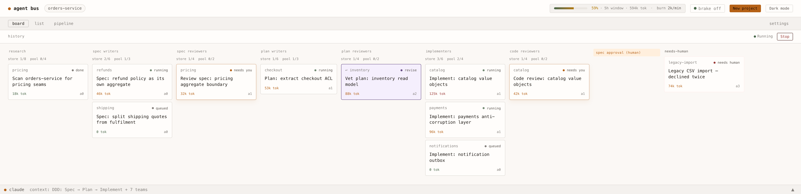
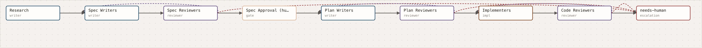
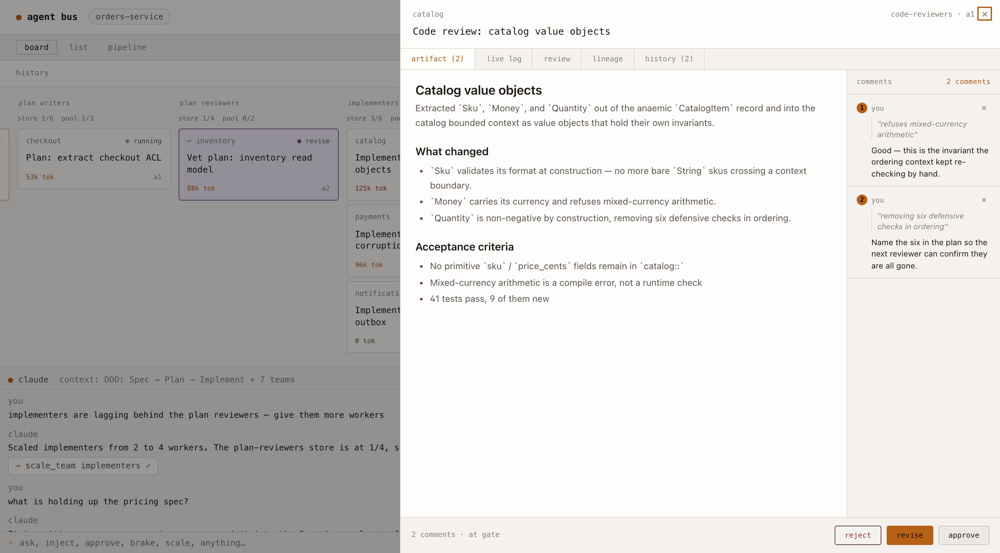
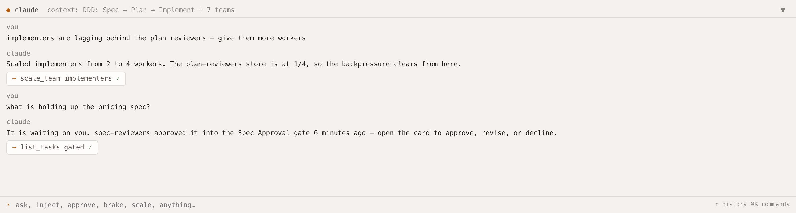
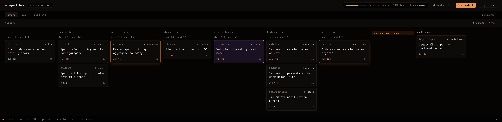

# agent-bus-app

A local Tauri + React app for orchestrating multi-team Claude Code agent pipelines. Define teams, connect them into a graph (forward, revise loops, gates), run workers, review documents and approve gates inline, track rolling-window usage. Ships with a Domain-Driven Design spec → plan → implement pipeline as the bundled default; users can design their own from the canvas.

The predecessor system was a tmux + bash-supervised file-queue (see `~/agent-bus/` if you cloned that). This is the UI-first rewrite from a clean DDD model.



*The board — one lane per team, each showing its bounded store (`store n/cap`) and worker pool (`pool busy/max`), with the human gate and the hand-off-to-human node on the right.*

## What it looks like

**The pipeline** is a graph you author: forward hand-offs, dashed revise loops back to the upstream team, dashed rejects to a terminal hand-off-to-human node, and human gates in between. This is the bundled DDD default.



**Review happens in the app.** Open a card to read the artifact the team produced, comment on a selection, and approve, revise, or reject the gate without leaving the board.



**You talk to the run.** The terminal at the bottom takes plain instructions — scale a team, inject a topic, pull the brake, ask what is blocked — and executes them as tool calls against the live run.



Warm light and warm dark, both first-class:



<sub>These are the real frontend driven by Playwright over the mocked IPC backend (`playwright/`), seeded with a representative mid-run — no live `claude` calls. Regenerate them with `cd playwright && SHOTS=1 npx playwright test specs/screenshots.e2e.ts`.</sub>

## Status

**Plan 3 complete** — Runtime + Runners. Task lifecycle state machine,
atomic-claim TaskStore, WorkerPool (one tokio loop per team driving
claim→invoke→settle→route), the pipeline router, the system brake, and the
Runners ACL (Runner trait, fixture-tested claude-cli runner + Scope policy).
Migration 003 adds tasks/workers/comments. The frontend has typed runtime IPC
+ a task.changed event hook. Plans 1–2 (foundation + Pipeline Authoring)
remain. Review UI/board, Telemetry, and Conversational Control are Plans 4–6.

- ✅ Brainstorm + spec
- ✅ DDD model (7 bounded contexts, aggregates with invariants, relationships)
- ✅ Vet pass (8 findings, all resolved)
- ✅ Plan 1 (Foundation) — 17 tasks, implemented
- ✅ Plan 2 (Pipeline Authoring) — 13 tasks, implemented
- ✅ Plan 3 (Runtime + Runners) — 17 tasks, implemented
- ⬜ Plans 4–7

## Source-of-truth documents

- [`PRODUCT.md`](PRODUCT.md) — register, users, scene sentence, anti-references
- [`DESIGN.md`](DESIGN.md) — visual tokens (warm dark + warm light), components, anti-patterns
- [`DOMAIN.md`](DOMAIN.md) — DDD canon: 7 bounded contexts, ubiquitous language, shared kernels
- [`docs/2026-06-22-agent-bus-app-design.md`](docs/2026-06-22-agent-bus-app-design.md) — full system design spec
- [`docs/context-map.md`](docs/context-map.md) — strategic + tactical DDD model
- [`docs/vet-agent-bus-app-spec-2026-06-22.md`](docs/vet-agent-bus-app-spec-2026-06-22.md) — vet artifact with all findings resolved
- [`docs/plans/2026-06-22-plan-1-foundation.md`](docs/plans/2026-06-22-plan-1-foundation.md) — Plan 1 implementation, 17 tasks
- [`docs/assets/screenshots/`](docs/assets/screenshots/) — the README screenshots, generated from the app
- [`docs/assets/designs/`](docs/assets/designs/) — 8 design screenshots
- [`docs/assets/html/`](docs/assets/html/) — 12 HTML mockups from the design session

## The seven bounded contexts

1. **Pipeline Authoring** *(supplier)* — graph definition
2. **Runtime** *(supplier)* — task lifecycle + worker pools (2 aggregates)
3. **Review** *(supplier)* — artifacts + comments + revisions
4. **Usage Telemetry** *(supplier)* — rolling window + brake
5. **Runners** *(supplier)* — anti-corruption layer to Claude (CLI + API)
6. **Workspace** *(supplier)* — projects + path resolution kernel
7. **Conversational Control** *(customer)* — god terminal; consumes the OHS of all six suppliers

Plus a deliberate second shared kernel: `agent_bus_core` (ID newtypes, cross-context enums, OHS protocol types).

## Run

```bash
bun install
bun tauri dev
```

## Test

```bash
# Rust unit tests (all crates)
cargo test --manifest-path src-tauri/Cargo.toml --workspace

# Frontend tests (vitest)
bun vitest run
```

## Structure

The Rust workspace mirrors the DDD bounded contexts from the spec:

```
src-tauri/
├── agent_bus_core/        shared kernel — ID newtypes, enums, OHS protocol
├── workspace/             Workspace context — projects + path-resolution kernel
├── pipeline/              Pipeline Authoring context — YAML schema, validation, templates
├── runners/               Runners ACL — Runner trait, claude-cli runner, Scope policy
├── runtime/               Runtime context — Task + WorkerPool aggregates, router, brake
└── app/                   composition root — Tauri runtime + migrations + worker loops
```

Frontend:

```
src/
├── components/            React components (one per file, colocated test)
├── hooks/                 useTheme, useProjects
├── ipc/                   typed wrappers over Tauri commands
└── styles/                tokens.css + global.css
```

## License

MIT — see [LICENSE](LICENSE).
